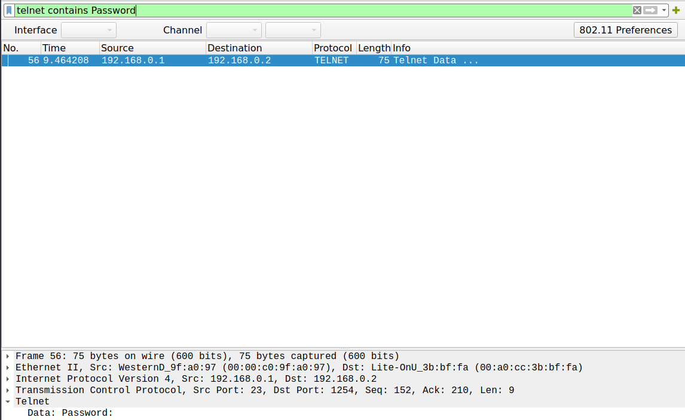

# Network Ch2 - TELNET - Authentication

Original challenge can be found at: <https://www.root-me.org/en/Challenges/Network/TELNET-authentication>

This challenge is about telnet a veteran under the network protocols. So its security :=) even though you can often upgrade crypto via startTLS, if supported.

However: We supposed to uncover a username and password. So just filter for telnet and it has to contain password:
```
telnet contains Password
```
Ah, packet 59 there it is and the following packets are the password in clear text. Each packet has just a single character. But no worries it is a pretty short password. After that telnet contains just some Shell commands and can be ignored.
