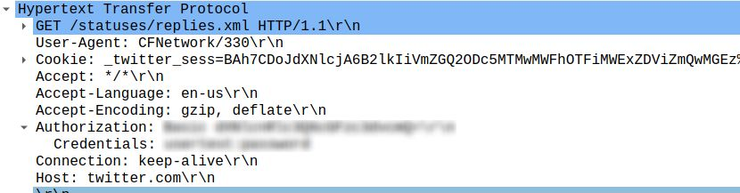

# Network Ch4 Twitter Authentication

Original challenge can be found at: <https://www.root-me.org/en/Challenges/Network/Twitter-authentication-101>

We have to retrieve the password for a twitter session. As twitter sits on the application level and we got a pcap file, this should be pertty easy.

After opening the pcap file, we see its HTTP in the application layer. Thus if we further investigate we found the http.authorization section, with a basic authentication mechanism. And this means no real security the password is encoded via Base64. 
But also in clear text in the authorization section were it states the credentials.

