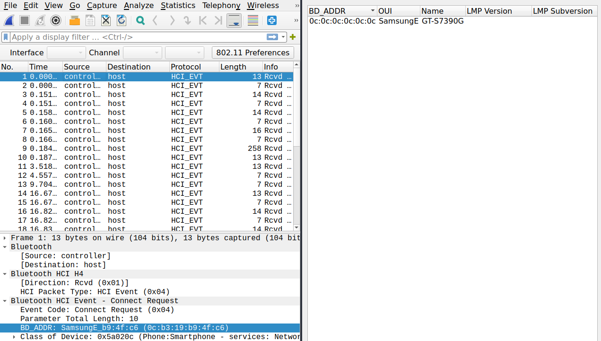

# Network Ch5 Bluetooth - Unknown file

Original challenge can be found at: <https://www.root-me.org/en/Challenges/Network/Bluetooth-Unknown-file>

This challenge goal is to find out MAC address and device name and calculate tha SHA1 value of the concatanation.

We get a binary file that is actually a BTSnoop file, if we run the file command we get:
```bash
file ch18.bin 
ch18.bin: BTSnoop version 1, HCI UART (H4)
```
This file can be analyzed via Wireshark.
Here comes the big advantag of Wireshark, after opening we can simply display the Bluetooth device. 



This will get us the device name and the MAC address, which we simply have to concat and let SHA1 run over this string.

The MAC address is
```
0c:b3:19:b9:4f:c6
```
Device Name:
```
C6GT-S7390G
```
And now just put it into the termial like this:
```
echo "XXXXXXXXXXXXXXXXXXX" | sha1sum